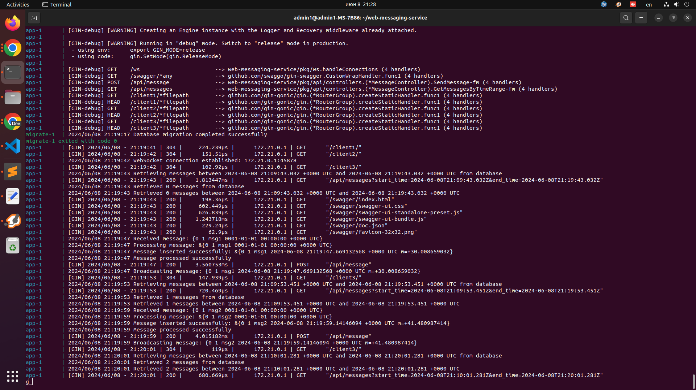
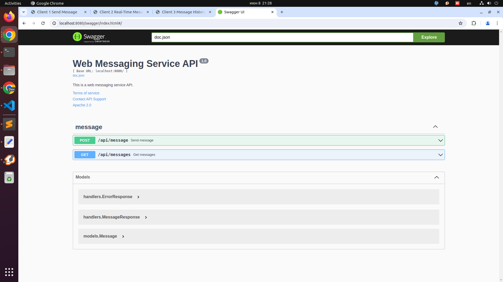
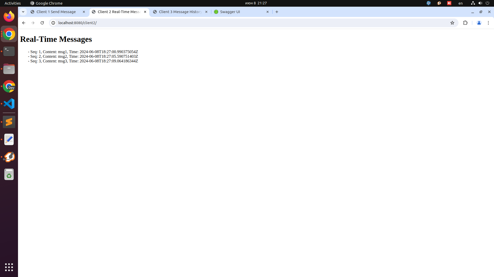
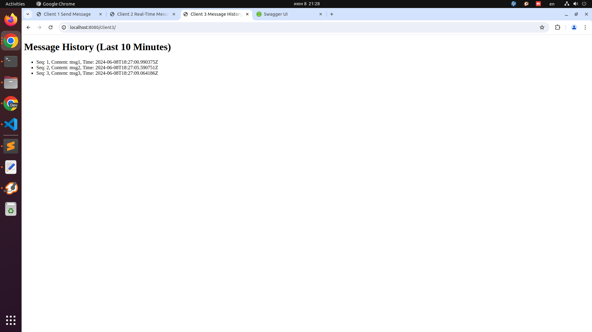

```
docker rm -f $(docker ps -a -q)
docker rmi -f $(docker images -aq)
docker volume rm $(docker volume ls -q)

sudo kill -9 $(sudo lsof -t -i:8080)

docker compose up --build
```

|||
|:---:|:---:|

||||
|:---:|:---:|:---:|